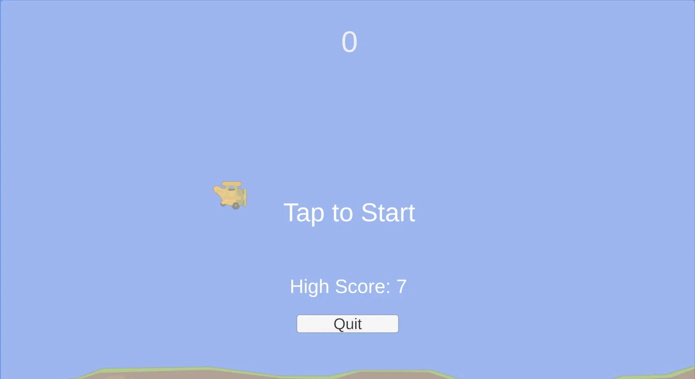
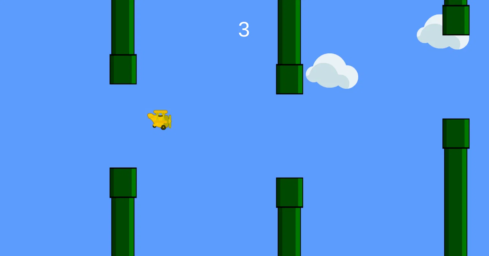
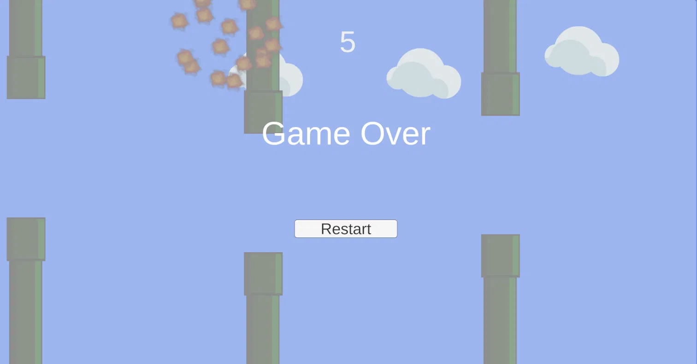

name: kobi sima
ID: 209063742

A Flappy Bird–style 2D game built from scratch in Unity. Mid-course assignment.

## Gameplay

Keep the plane airborne and fly through the gaps between pipes. Each pipe you clear scores a point. Hit a pipe or the ground and it's game over.

| Action | Input |
|---|---|
| Flap / Start game | `Space` or Left Click |
| Restart | Restart button (game over screen) |
| Quit | Quit button (start screen) |

## Screenshots

<p align="center">
  
  
</p>
<p align="center">
  
</p>

## Features

- Physics-based flap mechanic using `Rigidbody2D`
- Procedurally spawned pipes at randomized heights
- Score tracking with a persistent high score (`PlayerPrefs`)
- Particle-based explosion effect on crash
- Parallax clouds in the background
- Start screen, game over screen, restart and quit

## Running the Game

**Prebuilt (Windows):** run `Build/My Flappy Bird.exe`

**From source:** open the project in **Unity 6.3 LTS (6000.3.22f1)**, load `Assets/Scenes/SampleScene`, press Play.

## Built With

Unity 6.3 LTS · 2D Built-In Render Pipeline · C# · TextMeshPro · Unity Particle System

## Project Structure

```
Assets/
├── Scripts/     Game logic (Bird, GameManager, PipeSpawner, ScoreZone, ...)
├── Prefabs/     PipePair, ExplosionEffect, Cloud
├── Sprites/     Game art
└── Scenes/      SampleScene
```

## Asset Credits

All art is CC0 licensed:

- Plane, ground — [Tappy Plane](https://kenney.nl/assets/tappy-plane) by Kenney
- Clouds — [Background Elements](https://kenney.nl/assets/background-elements) by Kenney
- Explosion particles — [Smoke Particles](https://kenney.nl/assets/smoke-particles) by Kenney
- Pipes — [Flappy Bird Style Sprites](https://opengameart.org/content/flappy-bird-style-sprites) by Ian Peter
